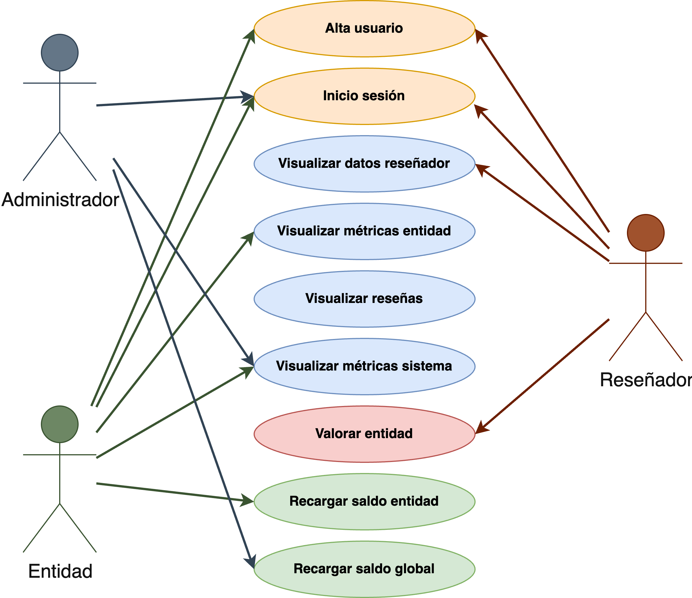
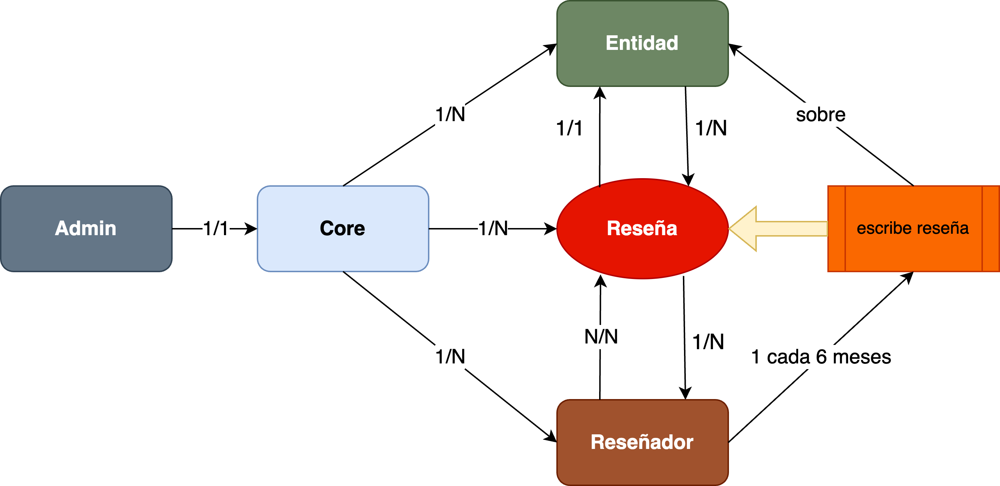

# Reseg — Decentralized Review System (DApp)
**Project completed on March 2023**

**Reseg** is a secure blockchain-based review system built on **Ethereum**, designed to bring transparency and trust to public reviews in Web 3.0.

This dApp is founded on the smart contracts contained in the contracts directory. Developed with the support of Truffle v5.7.2, Solidity v0.8.17, Node v18.13.0 and Web3.js v1.8.1.

---

## Disclaimer

This project was developed for academic purposes only.  
It is not intended for production use, and no guarantees are made regarding its security, performance, or functionality.  
Note: The administrator’s private keys** are visible in `session.service.ts`, and should never be used in a real blockchain environment.

---

## Overview
Reseg allows two types of users:
- **Entities** (companies/brands) register by depositing ETH to cover review costs and platform fees.
- **Reviewers** register freely and can post reviews about registered entities.
- An **Administrator** oversees metrics and manages the global contract balance.




All interactions (registration, reviews, balance operations) are handled through **smart contracts** for full transparency and immutability.

---

## ⚙️ System Components

### Core Smart Contract
Acts as the central hub connecting all entity contracts.
- Registers reviewers and entities.
- Manages global balances and metrics.
- Deploys entity-specific contracts using a **Contract Factory** pattern.

**Main functions:**
- `addNuevoUsuario()`
- `addNuevaEntidad()`
- `getDatosUsuario()`
- `getEntidades()`
- `getMetricasSistema()`
- `getContratoEnt()`
- `cargarSaldoGlobal()`

---

### Entity Smart Contract
Created per registered company. Stores reviews and manages its own balance.

**Main features:**
- Stores all reviews in a `struct Resena`.
- Each user can post one review every 6 months.
- Calculates metrics (average rating, number of reviews, recent reviews).
- Allows the company to recharge its balance.

**Key functions:**
- `valorar()`
- `recargarSaldo()`
- `getResenias()`
- `getMetricas()`



---

## User Interfaces
- **Login** (via wallet or MetaMask)
- **Registration**
  - Reviewer: username, full name, date of birth
  - Entity: commercial name, initial balance
- **Reviewer Dashboard**: view profile, entities list, submit reviews
- **Entity Dashboard**: view reviews, metrics, and recharge balance
- **Admin Panel**: view system stats and top up global contract

---

## Data Structures
```solidity
struct Usuario {
  string username;
  string fullName;
  uint birthDate;
}

struct Resena {
  string author;
  uint date;
  uint rating;
  string title;
  string body;
}
`````

---

Disclaimer: Project for academic purposes. Not guaranteed functionality and security. Private keys of the system admin visible in session.service.ts

## Development server

Run `ng serve` for a dev server. Navigate to `http://localhost:4200/`. The application will automatically reload if you change any of the source files.

## Code scaffolding

Run `ng generate component component-name` to generate a new component. You can also use `ng generate directive|pipe|service|class|guard|interface|enum|module`.

## Build

Run `ng build` to build the project. The build artifacts will be stored in the `dist/` directory.

## Running unit tests

Run `ng test` to execute the unit tests via [Karma](https://karma-runner.github.io).

## Running end-to-end tests

Run `ng e2e` to execute the end-to-end tests via a platform of your choice. To use this command, you need to first add a package that implements end-to-end testing capabilities.

## Further help

To get more help on the Angular CLI use `ng help` or go check out the [Angular CLI Overview and Command Reference](https://angular.io/cli) page.

---

